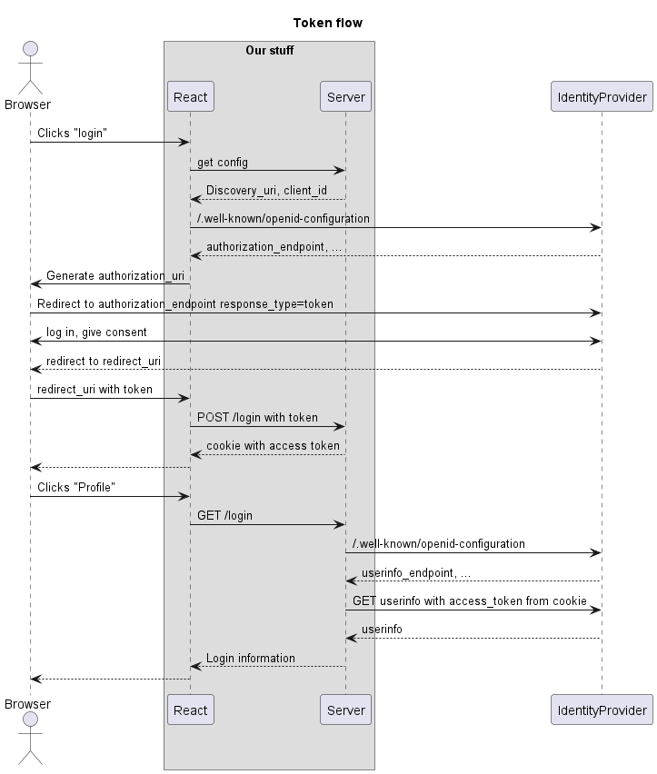
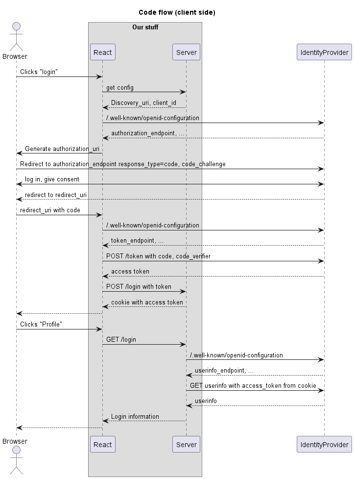

# OpenID Connect - log on with Google

TOKEN FLOW (`response_type: "token"`)

* [x] npm install react, express and dev tools
* [x] `npm run dev` scripts
* [x] display login button when user is unauthenticated
* [x] redirect to authorization url
* [x] handle callback with access_token
* [x] Save token in cookie
* [x] Save logins to MongoDB
* [x] Fetch user information from userinfo call with token
* [ ] Deploy to Heroku with heroku git
* [ ] Using MongoDB and .env at Heroku
* [ ] Setup Google to for redirect to Heroku

# Lecture 11: OpenID connect with code flow

CODE FLOW (`response_type: "code"`)

* [ ] Demonstrate setting up of working application with Active Directory (PAY ATTENTION - NO COMMITS)
* [ ] Update openid_configuration URL and client_id to Azure Entra ID
* [ ] Change the authorization URL to use `response_type=code` and `code_challenge`
* [ ] Handle exchange of code to access token with `fetch(token_endpoint, {method: "POST", body: new URLSearchParam(...)}`